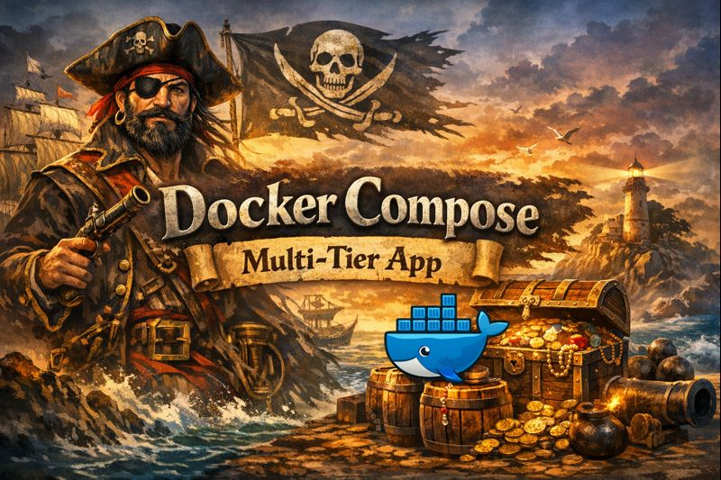

# 🐳 Assignment 6: Docker Compose Multi-Tier Application

<br/>

<div align="center">
  
</div>

<br/>


**A production-ready multi-tier application demonstrating container orchestration, microservices architecture, and DevOps best practices.**

---

## 📋 Table of Contents

- [Overview](#overview)
- [Architecture](#architecture)
- [Features](#features)
- [Prerequisites](#prerequisites)
- [Quick Start](#quick-start)
- [Project Structure](#project-structure)
- [Configuration](#configuration)
- [Development](#development)
- [Production Deployment](#production-deployment)
- [DevOps Analysis](#devops-analysis)
- [Troubleshooting](#troubleshooting)
- [License](#license)

---

## 🎯 Overview

This project implements a **complete multi-tier application stack** using Docker Compose, showcasing:

- **5 interconnected services** working in harmony
- **Multi-stage Docker builds** for optimized images
- **Custom network segmentation** for security
- **Health monitoring** and automatic recovery
- **Environment-specific configurations** (dev/staging/prod)
- **Data persistence** with named volumes
- **Resource management** with CPU and memory limits

**Use Case:** Task management application with real-time caching and persistent storage.

---

## 🏗️ Architecture
```
┌─────────────┐
│   Browser   │
└──────┬──────┘
       │ :80
       ▼
┌─────────────────┐
│  Nginx Proxy    │  ← Reverse proxy & load balancer
└────┬───────┬────┘
     │       │
     │ /     │ /api
     ▼       ▼
┌─────────┐ ┌──────────┐
│Frontend │ │ Backend  │  ← Application layer
│ (Nginx) │ │ (Flask)  │
└─────────┘ └────┬─────┘
                 │
          ┌──────┴──────┐
          │             │
          ▼             ▼
    ┌──────────┐  ┌────────┐
    │PostgreSQL│  │ Redis  │  ← Data layer
    └──────────┘  └────────┘
```

### Network Topology
```
┌────────────────────────┐  ┌────────────────────────┐
│  Frontend Network      │  │  Backend Network       │
│  (Public-facing)       │  │  (Internal only)       │
├────────────────────────┤  ├────────────────────────┤
│ • Nginx Proxy          │  │ • Backend API          │
│ • Frontend App    ←────┼──┤ • PostgreSQL DB        │
│                        │  │ • Redis Cache          │
└────────────────────────┘  └────────────────────────┘
```

**Security:** Frontend cannot directly access the database - all requests go through the Backend API.

📖 **[Detailed Architecture Documentation →](docs/ARCHITECTURE.md)**

---

## ✨ Features

### 🔐 Security
- ✅ Non-root users in all containers
- ✅ Network segmentation (2 isolated networks)
- ✅ No hardcoded secrets (environment variables)
- ✅ Minimal Alpine-based images (reduced attack surface)

### 🚀 Performance
- ✅ Multi-stage Docker builds (60% smaller images)
- ✅ Redis caching layer (faster responses)
- ✅ Nginx gzip compression
- ✅ Resource limits (prevent resource starvation)

### 📊 Observability
- ✅ Health checks on all services
- ✅ Structured logging
- ✅ Dependency health monitoring (`/health` endpoint)

### 🔄 DevOps
- ✅ Infrastructure as Code (docker-compose.yml)
- ✅ Environment-specific configurations
- ✅ Automated backup scripts
- ✅ Service discovery (Docker DNS)

---

## 📦 Prerequisites

- **Docker Desktop**: 4.25+ ([Download](https://www.docker.com/products/docker-desktop))
- **Docker Compose**: 2.0+ (included with Docker Desktop)
- **System Requirements:**
  - 4GB RAM minimum
  - 10GB free disk space
  - Windows 10/11, macOS 11+, or Linux

### Verify Installation
```bash
docker --version
# Docker version 24.0.0 or higher

docker-compose --version
# Docker Compose version 2.0.0 or higher
```

---

## 🚀 Quick Start

### 1. Clone the Repository
```bash
git clone https://github.com/yourusername/jhon-docker-compose-assignment.git
cd jhon-docker-compose-assignment
```

### 2. Configure Environment
```bash
# Copy example environment file
cp .env.example .env

# Edit .env with your settings (optional for local development)
```

### 3. Build and Start Services
```bash
# Build all images and start services
docker-compose up --build -d

# Wait for all services to be healthy (~60 seconds)
docker-compose ps
```

Expected output:
```
NAME            STATUS                  PORTS
jhon-backend    Up (healthy)           5000/tcp
jhon-frontend   Up (healthy)           3000/tcp
jhon-nginx      Up (healthy)           0.0.0.0:80->80/tcp
jhon-postgres   Up (healthy)           5432/tcp
jhon-redis      Up (healthy)           6379/tcp
```

### 4. Initialize Database
```bash
curl -X POST http://localhost/api/init-db
```

### 5. Access Application

Open your browser: **http://localhost**

You should see the task management interface with sample tasks pre-loaded.

---

## 📁 Project Structure
```
jhon-docker-compose-assignment/
│
├── 📁 backend/                      # Backend API (Flask)
│   ├── Dockerfile                   # Multi-stage build
│   ├── requirements.txt             # Python dependencies
│   └── src/
│       └── app.py                   # Flask application
│
├── 📁 frontend/                     # Frontend UI (HTML/JS)
│   ├── Dockerfile                   # Multi-stage build with Nginx
│   ├── nginx.conf                   # Nginx configuration
│   └── src/
│       └── index.html               # Single-page application
│
├── 📁 nginx/                        # Reverse Proxy
│   ├── Dockerfile
│   └── nginx.conf                   # Routing configuration
│
├── 📁 scripts/                      # Automation scripts
│   └── backup.ps1                   # Database backup script
│
├── 📁 docs/                         # Documentation
│   ├── DEVOPS-ANALYSIS.md          # DevOps methodology
│   ├── ARCHITECTURE.md             # Detailed architecture
│   └── TROUBLESHOOTING.md          # Common issues
│
├── docker-compose.yml               # Base configuration
├── docker-compose.dev.yml           # Development overrides
├── docker-compose.prod.yml          # Production overrides
├── .env.example                     # Environment template
└── README.md                        # This file
```

---

## ⚙️ Configuration

### Environment Variables

Create a `.env` file with the following variables:
```env
# Database Configuration
DB_NAME=jhon_db
DB_USER=jhon_user
DB_PASSWORD=your_secure_password_here

# Redis Configuration
REDIS_PASSWORD=your_redis_password_here

# Application Configuration
FLASK_ENV=production
NGINX_PORT=80
```

### Resource Limits

Each service has defined resource limits in `docker-compose.yml`:

| Service | CPU Limit | Memory Limit |
|---------|-----------|--------------|
| Backend | 1.0 cores | 512 MB |
| Frontend | 0.5 cores | 256 MB |
| Nginx | 0.5 cores | 256 MB |
| PostgreSQL | 1.0 cores | 512 MB |
| Redis | 0.5 cores | 256 MB |

**Total:** ~4.5 CPU cores, ~2.5 GB RAM

---

## 💻 Development

### Development Mode
```bash
# Start with development overrides
docker-compose -f docker-compose.yml -f docker-compose.dev.yml up

# Features enabled:
# - Hot reload for backend code
# - Debug mode enabled
# - Exposed ports for direct access
# - Verbose logging
```

### Access Services Directly

In development mode, services are exposed on these ports:

- **Frontend:** http://localhost:3000
- **Backend API:** http://localhost:5000
- **Nginx Proxy:** http://localhost:8080
- **PostgreSQL:** localhost:5432
- **Redis:** localhost:6379

### View Logs
```bash
# All services
docker-compose logs -f

# Specific service
docker-compose logs -f jhon-backend

# Last 50 lines
docker-compose logs --tail=50 jhon-backend
```

### Run Tests
```bash
# Backend tests
docker-compose exec jhon-backend pytest

# Check health
curl http://localhost/health
```

---

## 🚀 Production Deployment

### Production Mode
```bash
# Start with production optimizations
docker-compose -f docker-compose.yml -f docker-compose.prod.yml up -d

# Features:
# - No exposed ports (only Nginx on :80)
# - Increased resource limits
# - Optimized logging
# - Auto-restart enabled
```

### Backup Database
```bash
# Manual backup
./scripts/backup.ps1

# Backups are stored in: ./backups/
```

### Update Services
```bash
# Pull latest images
docker-compose pull

# Rebuild and restart
docker-compose up -d --build

# Zero-downtime deployment (future improvement)
```

---

## 🔍 DevOps Analysis

This project demonstrates professional DevOps practices:

### 📊 Planning & Architecture
- Requirements analysis
- Multi-tier architecture design
- Network topology planning
- Capacity planning

### 🛠️ Implementation
- Infrastructure as Code (IaC)
- Multi-stage Docker builds
- Security hardening
- Health monitoring

### 📈 Operations
- Environment management
- Data persistence strategy
- Backup and recovery
- Resource optimization

📖 **[Complete DevOps Analysis →](docs/DEVOPS-ANALYSIS.md)**

---

## 🐛 Troubleshooting

### Services Not Starting
```bash
# Check service status
docker-compose ps

# View logs
docker-compose logs jhon-backend

# Restart specific service
docker-compose restart jhon-backend
```

### Port Already in Use
```bash
# Windows: Find process using port 80
netstat -ano | findstr :80

# Kill process (replace PID)
Stop-Process -Id <PID> -Force
```

### Database Connection Issues
```bash
# Check PostgreSQL health
docker-compose exec jhon-postgres pg_isready -U jhon_user

# Reset database
docker-compose down -v
docker-compose up -d
curl -X POST http://localhost/api/init-db
```

📖 **[Full Troubleshooting Guide →](docs/TROUBLESHOOTING.md)**

---

## 📊 Metrics

### Image Sizes
```
jhon-backend:    142 MB  (optimized with Alpine)
jhon-frontend:   74 MB   (optimized with Alpine)
jhon-nginx:      74 MB   (optimized with Alpine)
postgres:15-alpine: 238 MB
redis:7-alpine:  32 MB

Total: ~560 MB (vs 2+ GB without optimization)
```

### Performance

- **Cold start:** ~60 seconds (all services healthy)
- **Warm start:** ~10 seconds (cached images)
- **Response time:** <50ms (with Redis cache)
- **Memory usage:** ~1.5 GB (all services running)

---

## 🎓 Learning Outcomes

This project teaches:

1. **Container Orchestration** - Managing multiple services with Docker Compose
2. **Microservices Architecture** - Separation of concerns across services
3. **Network Segmentation** - Security through network isolation
4. **Data Persistence** - Stateful services with volumes
5. **Infrastructure as Code** - Declarative infrastructure management
6. **DevOps Practices** - CI/CD-ready configuration

---

## 🚀 Next Steps

- [ ] Implement CI/CD pipeline (GitHub Actions)
- [ ] Add monitoring (Prometheus + Grafana)
- [ ] Migrate to Kubernetes
- [ ] Deploy to AWS Lightsail
- [ ] Add automated tests
- [ ] Implement blue-green deployment

---

## 📝 License

This project is part of a DevOps learning assignment and is available for educational purposes.

---

## 👤 Author

**Jonathan Vega**
- Role: Principal DevOps Engineer 
- GitHub: [@JohnMaldonado](https://github.com/JohnMaldonado)
- LinkedIn: [John](https://linkedin.com/)

---

## 🙏 Acknowledgments

- Docker Documentation
- Flask Framework
- PostgreSQL Community
- Redis Community
- Nginx Documentation

---

**Built with ❤️ using Docker Compose**

